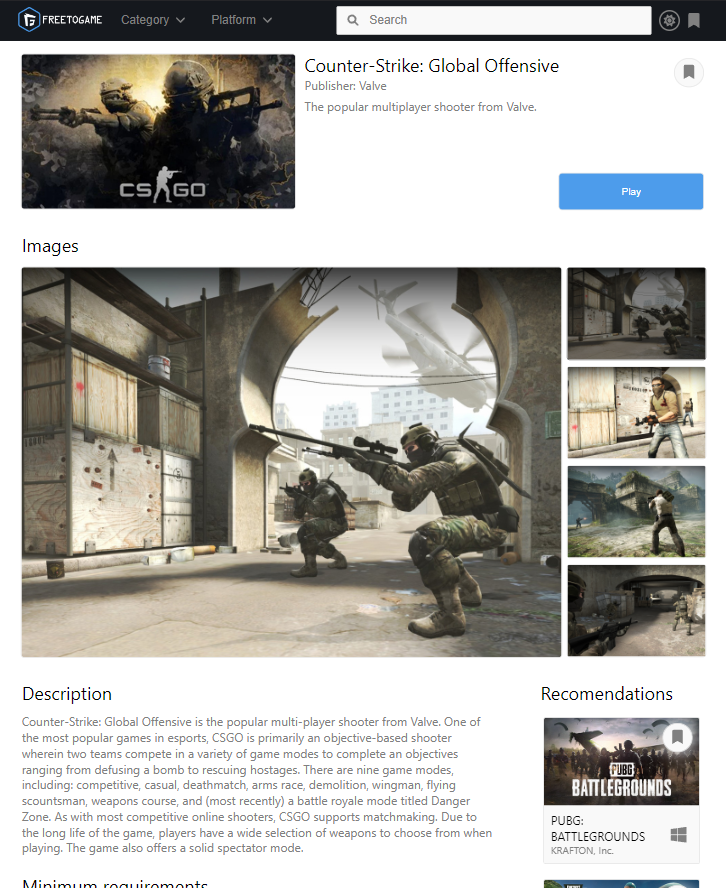

# Primer proyecto en React

ECommerce de [free-to-play API](https://www.freetogame.com/api-doc)

## Tecnologías utilizadas

- React { Context API, LocalStorage, React-Router-Dom }
- Vite

---

---

**[DEMO](https://game-store-two.vercel.app/)**